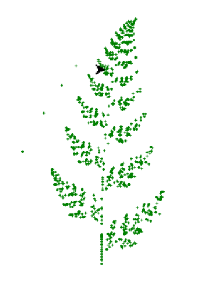
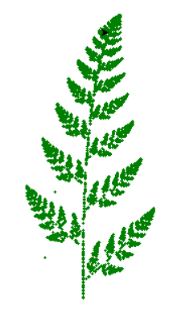

# Barnsley Fern Fractal

A Python project that generates the Barnsley Fern fractal using an Iterated Function System (IFS). The repository contains two different implementations that produce the same fractal using different visualization methods.

## Features

* Generates the Barnsley Fern fractal
* Uses probabilistic affine transformations
* Two visualization approaches
* Demonstrates fractal geometry and chaos theory concepts
* Built with Python and NumPy

## Implementations

### 1. Turtle Graphics Version

**File:** `Barnsley (turtle).py`

Draws the fractal point-by-point using Python's built-in Turtle Graphics library.

**Advantages:**

* Easy to understand
* Visualizes the drawing process in real time
* Suitable for learning fractal generation

### 2. Matplotlib Version

**File:** `Barnsley (matplotlib).py`

Generates points and plots them using Matplotlib.

**Advantages:**

* Faster rendering
* Handles larger numbers of points efficiently
* Produces cleaner visualizations

## Requirements

Install the required packages:

```bash
pip install numpy matplotlib
```

The Turtle version only requires NumPy because Turtle is included with Python.

## How to Run

### Turtle Version

```bash
python Barnsley (turtle).py
```

### Matplotlib Version

```bash
python Barnsley (matplotlib).py
```

## Example Output

The program generates the famous Barnsley Fern fractal, a mathematical structure that resembles a natural fern leaf.






## How It Works

The Barnsley fern is generated by repeatedly applying one of four affine transformations.

At each iteration:

1. A transformation is selected according to a probability distribution.
2. New coordinates are calculated.
3. The resulting point is plotted.
4. Repeating this process thousands of times creates the fern shape.

## Technologies Used

* Python 3
* NumPy
* Turtle Graphics
* Matplotlib

## Learning Objectives

This project demonstrates:

* Fractal generation
* Iterated Function Systems (IFS)
* Randomized algorithms
* Data visualization
* Mathematical programming

## Future Improvements

* Interactive GUI
* Adjustable probabilities
* Animation controls
* Multiple fractal types
* High-resolution image export

## License

This project is licensed under the MIT License.

## Author

**Mohammad Reza Bakhshandeh**

Electrical Engineering (Electronics) Graduate

Interested in Python Development, Computer Vision, Machine Learning, and Artificial Intelligence.
